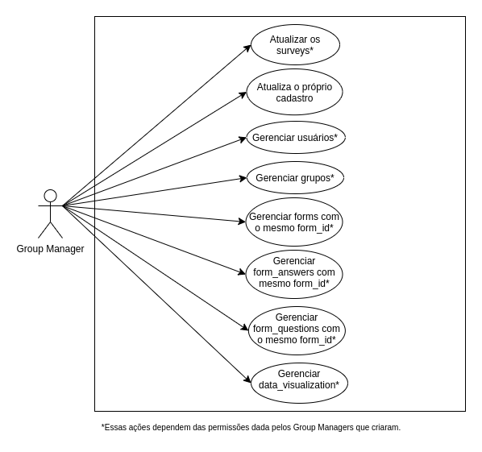

# Permissões de usuários

Esse documento tem como objetivo explicar as permissões que cada usuário tem na API de uma forma gráfica e de fácil entendimento. Também tem como função validar cada uma das permissões existentes.

Segue abaixo as permissões que cada um dos 6 tipos de usuários possuem na API:

## Admin

## Manager

## CityManager

## GroupManager

## GroupManagerTeam

## User

